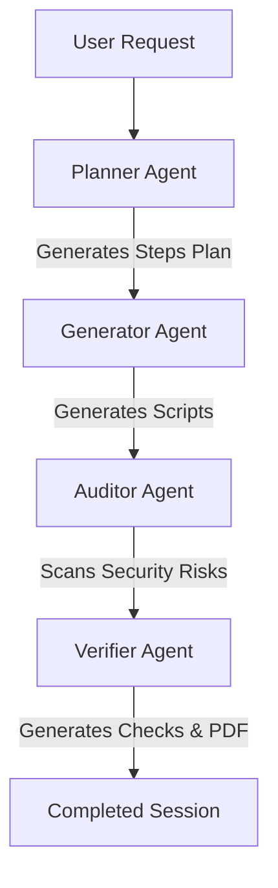

# InstallGen AI – Multi-Agent Installation Automation platform

InstallGen AI is a state-of-the-art autonomous multi-agent swarming platform designed to automate, inspect, and verify software system configurations, software package setups, and service deployments. By orchestrating a pipeline of specialized AI agents, the platform plans setup workflows, generates safe scripts, audits code security, and verifies daemon binding integrity.

---

##  Key Features

* **Real-Time Multi-Agent Orchestration:** Sequentially runs specialized agents (Planner, Generator, Auditor, Verifier) to process natural language installation requests.
* **Stateless JWT Authentication:** Built-in security with JSON Web Tokens (JWT), password hashing (`bcrypt`), and user session persistence.
* **Role-Based Access Control (RBAC):** Restricts route access and controls system privileges based on user roles (`Admin`, `Support Engineer`, `Employee`).
* **Interactive DevOps Assistant:** Direct chat view powered by AI to resolve configuration queries.
* **AI-Guided Troubleshooting:** Logs parser to isolate installation errors, analyze stack issues, and write automated recovery scripts.
* **Audit & Compliance Checks:** Real-time scanning of generated script contents to prevent privilege escalations and injection risks.
* **PDF Report Builder:** Generates polished verification reports detailing scorecards, logs, and executable files.

---

##  Technology Stack

### Backend Services
* **Core Framework:** [FastAPI](https://fastapi.tiangolo.com/) (Python 3.9+) for high-performance, asynchronous REST APIs.
* **ORM & Database:** [SQLAlchemy](https://www.sqlalchemy.org/) with a local [SQLite](https://www.sqlite.org/) database.
* **Security & Tokens:** [PyJWT](https://pyjwt.readthedocs.io/) for JWT encoding/decoding and [bcrypt](https://pypi.org/project/bcrypt/) for password hashing.
* **Verification Reports:** [ReportLab](https://www.reportlab.com/) to build structural PDF verification scorecards.

### Frontend Web Application
* **Framework:** [React](https://react.dev/) (v19) with [TypeScript](https://www.typescriptlang.org/) and [Vite](https://vite.dev/) for fast compilation and bundling.
* **Styling System:** [Tailwind CSS](https://tailwindcss.com/) mapped to a custom **purple, black, and white** palette.
* **Icons Library:** [Lucide React](https://lucide.dev/) for dashboard and sidebar icons.

---

## 🧠 AI Models & SDKs

The system communicates with Google’s official advanced models using the new unified **`google-genai` SDK**:
* **Generation & Planning Model:** `gemini-2.5-flash`
  * Leveraged for low-latency JSON response outputs, planning layouts, generating functional code blocks, auditing commands, and interactive chats.
* **JSON Schema Enforcements:** Utilizes Gemini's native structured outputs (`response_mime_type="application/json"`) to validate Pydantic payload models.

---

## 🤖 Multi-Agent Swarm Pipeline

When an installation request is launched, the platform executes a sequential background pipeline:



1. **Planner Agent:** Analyzes the plain-English setup requirements and compiles a structured list of distinct installation steps.
2. **Generator Agent:** Automatically writes complete, executable code blocks (e.g., Bash or PowerShell) for each planned step.
3. **Auditor Agent:** Scans the script files for security risks (e.g., hardcoded keys, remote executions, command injections) and scores the scripts out of 100.
4. **Verifier Agent:** Compiles post-installation validation checks (such as socket checks and configuration reviews) and constructs the final PDF scorecard.

---

## 🔐 Security & User Management

* **Protected APIs:** Core endpoints (deployments, scripts, reports, AI assistant, troubleshooting) require a valid `Authorization: Bearer <JWT>` token in the header.
* **Default Seeding:** The backend automatically registers a default system administrator account on startup if the user database is empty:
  * **Email:** `admin@installgen.ai`
  * **Password:** `AdminPass123`
  * **Role:** `Admin`
* **Admin Controls:** Users with the `Admin` role can access the **Admin Panel** to view system-wide stats (users, active sessions, total requests, reports), update registered users' roles, or delete accounts.

---

## 📂 Project Directory Structure

```text
├── backend/            # FastAPI Backend & SQLite database configuration
│   ├── app/            # FastAPI Application Source Code
│   │   ├── api/        # Routers, Middlewares, and security dependencies
│   │   ├── core/       # Database connections, config settings, security utils
│   │   ├── crud/       # DB queries and helper methods
│   │   ├── models/     # SQLAlchemy/Database schemas
│   │   ├── schemas/    # Pydantic schemas (request/response validation)
│   │   └── services/   # Business logic, orchestrator, and Gemini APIs
│   ├── requirements.txt # Python dependency requirements
│   └── .env.example    # Environment configurations sample
│
└── frontend/           # React + Vite + Tailwind CSS Frontend
    ├── src/            # React App Source Code
    │   ├── assets/     # Static images and logo assets
    │   ├── components/ # Reusable layout components (Sidebar, etc.)
    │   ├── context/    # React Context providers (AuthContext, etc.)
    │   ├── hooks/      # Custom React hooks
    │   ├── pages/      # Route/View pages (Dashboard, Admin, LoginPage, etc.)
    │   ├── services/   # Frontend API integrations (api.ts)
    │   ├── App.tsx     # Main dashboard view component and routing guard
    │   ├── index.css   # Main Tailwind and global styles
    │   └── main.tsx    # React application entrypoint
    ├── tailwind.config.js # Tailwind CSS color and theme customization
    ├── vite.config.ts  # Vite build configuration
    └── package.json    # Frontend dependency details
```

---

## ⚙️ Getting Started

### Prerequisites
* Python 3.9+
* Node.js 18+ (with npm)

### Running the Backend (FastAPI)
1. Navigate to `/backend`:
   ```bash
   cd backend
   ```
2. Create and activate a Python virtual environment:
   ```bash
   python -m venv venv
   # On Windows:
   venv\Scripts\activate
   # On macOS/Linux:
   source venv/bin/activate
   ```
3. Install required Python packages:
   ```bash
   pip install -r requirements.txt
   ```
4. Run the development server:
   ```bash
   uvicorn app.main:app --reload
   ```
   * *API Documentation is available at: [http://127.0.0.1:8000/docs](http://127.0.0.1:8000/docs)*

### Running the Frontend (React + Vite)
1. Navigate to `/frontend`:
   ```bash
   cd frontend
   ```
2. Install Node packages:
   ```bash
   npm install
   ```
3. Run the development server:
   ```bash
   npm run dev
   ```
   * *The web interface is available at: [http://localhost:5173](http://localhost:5173)*
